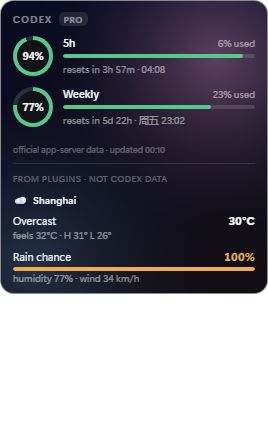
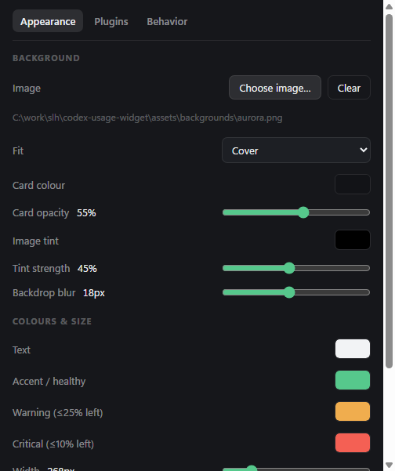

# Codex Usage Widget

[English](README.md) | 简体中文

桌面小组件，实时显示 **OpenAI Codex** 剩余额度——**5 小时窗口**与**周窗口**、重置倒计时；卡片外观可自定义，还能挂插件面板。

数据不是估算，也不是从日志里推算的：直接读本机 `codex app-server` 的 `account/rateLimits/read`——**Codex 官方客户端画自己那个用量界面时，调的就是这个**。读额度不开 thread、不发 turn，不消耗任何额度。



> 非官方项目，与 OpenAI 无从属、认可或赞助关系。「Codex」「OpenAI」是 OpenAI 的商标，此处仅用于说明本工具对接的对象。

---

## 前置条件

- **Node.js ≥ 18**（用到全局 `fetch`）
- **已安装并登录 Codex**（桌面端或 CLI 均可），用 `codex login status` 确认。组件是拉起本机 `codex` 的 `app-server` 模式；没装或没登录就只会显示连不上。
- Codex 版本需支持 `account/rateLimits/read`（已在 **codex-cli 0.130 / 0.144** 上验证）。旧版本没有这个方法，会报错而不是显示数字。
- **Windows** 是实测平台（托盘、开机自启、`start-widget.vbs` 都是 Windows 特有）。macOS/Linux 的可执行文件探测和核心代码都写了，但未实测。

## 下载（Windows）

**[⬇ 去 Releases 下载最新版](https://github.com/shilihao1998-ux/codex-usage-widget/releases/latest)** —— 不需要 Node、不需要终端、不需要 clone。

| 文件 | 说明 |
| --- | --- |
| `Codex-Usage-Widget-Setup-<版本>.exe` | 安装版，会建开始菜单和桌面快捷方式 |
| `Codex-Usage-Widget-<版本>-portable.exe` | 免安装版，双击直接跑，不写注册表 |

两点提醒：

- 二进制**没有代码签名**，首次运行 Windows SmartScreen 会弹蓝色「未知发布者」警告，点**更多信息 → 仍要运行**即可。（签名证书要花钱，这是个免费工具。）
- 仍然需要**本机装了 Codex 并已登录**——额度是从本机 Codex app-server 读的。没有 Codex，卡片只会显示连不上。

## 从源码运行

```bash
git clone https://github.com/shilihao1998-ux/codex-usage-widget.git
cd codex-usage-widget
npm install    # 同时下载 Electron 二进制（约 100 MB，来自 GitHub release）
npm start
```

网络不好可以给 Electron 二进制指个镜像：

```bash
ELECTRON_MIRROR=https://registry.npmmirror.com/-/binary/electron/ npm install
```

静默启动（无控制台窗口）：双击 `start-widget.vbs`。开机自启：托盘图标 → **Start with Windows**。

## 数据来源

Codex 客户端与本机 `codex app-server` 之间走 stdio 上的 JSON-RPC，本组件说的就是这套协议：

| 调用 | 用途 |
| --- | --- |
| `account/rateLimits/read` | 额度快照（无参数） |
| `account/rateLimits/updated` | 服务端推送，每次消耗额度后触发 |
| `account/read` | 账号邮箱与 plan |

原始返回：

```jsonc
{
  "rateLimits": {
    "limitId": "codex",
    "primary":   { "usedPercent": 12, "windowDurationMins": 300,   "resetsAt": 1783828956 },
    "secondary": { "usedPercent": 22, "windowDurationMins": 10080, "resetsAt": 1784354520 },
    "credits": { "hasCredits": false, "unlimited": false, "balance": "0" },
    "planType": "pro"
  },
  "rateLimitsByLimitId": { "codex": { ... }, "codex_bengalfox": { ... } }
}
```

- `primary` = 300 分钟 = **5 小时窗口**
- `secondary` = 10080 分钟 = **周窗口**
- `resetsAt` 是绝对 Unix 时间戳，所以两次轮询之间（乃至重启之后）倒计时都不会漂
- `rateLimitsByLimitId` 可能给出 `codex` 之外的独立计量桶（本账号上是 `codex_bengalfox` = GPT-5.3-Codex-Spark），开 **Show all limit buckets** 可见

刷新策略：60 秒轮询一次；另外订阅 `account/rateLimits/updated`，一收到推送立刻重读权威快照。

这是 Codex 内部组件之间的私有协议，OpenAI 随时可能改或删。真改了组件会直接报错，而不是猜一个数糊弄。卡片也会标注自己的可信度：`cached`（磁盘上的旧快照，本次启动还没读到实时值）、`stale`（超过 5 分钟没刷新成功）。

`~/.codex/sessions/**/rollout-*.jsonl` 里也有 `rate_limits`，但那只是**上一次 turn 的快照**，不能当实时值。`npm run verify` 会把实时读数和日志里的快照并排打出来对账。

## 小组件

- 拖动移动，位置会记住；上次的显示器被拔掉时自动回到主屏（托盘也有 **Reset position**）
- 悬停出现 ⟳ 刷新、⚙ 设置、⋯ 菜单、✕ 隐藏（托盘图标可唤回）
- 托盘图标是个环，按剩余额度着色（>25% 绿、≤25% 橙、≤10% 红），悬停显示两个窗口
- **低额度提醒**：剩余跌破 20% / 10% 时弹一次系统通知，同一窗口周期内不重复（阈值可改）

### 外观

设置 → **Appearance**：

- **背景图**：任意本地图片（png/jpg/gif/webp/bmp/avif，≤12 MB），fit 支持 cover / contain / stretch / tile；自带三张壁纸：安装版在应用目录的 `resources/backgrounds/`，源码版在 `assets/backgrounds/`（`npm run backgrounds` 可重新生成）
- **压暗层**：颜色 + 强度，盖在图片上保证文字可读
- 卡片颜色、不透明度、背景模糊、圆角、宽度、文字缩放
- 配色：文字色、健康色（剩余 >25%）、警告色（≤25%）、危险色（≤10%）——环形图、进度条、插件面板全跟着变

图片由主进程读成 `data:` URL 交给渲染进程（页面没有 Node 权限，CSP 也只允许这一种），不给页面开本地文件访问口子。



### 行为

设置 → **Behavior**：紧凑模式、显示全部计量桶、窗口置顶、窗口不透明度、低额度提醒及其阈值。

## 插件

额度行下面可以挂任意面板——天气、磁盘、股价、服务器状态，随你。

**契约：插件只取数、只返回结构化的行（label / value / sub / 进度条 / 色调），渲染由组件做。** 插件不能返回 HTML、碰不到渲染进程，所以第三方插件既坏不了布局也偷不走页面，而且样式天然跟着你的主题。

- 自带示例：`plugins/weather/`（Open-Meteo，免 API key，配城市名或经纬度，默认关闭）
- 你自己的插件放 `~/.codex-usage-widget/plugins/<id>/`——设置 → **Plugins** → *Open plugins folder* 直达
- 设置 → **Plugins**：开关、编辑配置 JSON、**Reload plugins** 热加载、错误就地显示
- 插件的 HTTP 走 Electron `net.fetch`，**跟随系统代理**
- ⚠️ **插件跑在主进程，有完整 Node 权限**（能读文件、能执行代码）。只装你信得过的插件，标准跟装 npm 包一样。
- 写法见 [PLUGINS.zh-CN.md](PLUGINS.zh-CN.md)

## 命令行

```bash
node bin/codex-usage.js once          # 打印当前额度
node bin/codex-usage.js once --json   # JSON 输出
node bin/codex-usage.js watch         # 常驻，变化即打印
node bin/codex-usage.js verify        # 实时读数 vs Codex 自己记的快照
node bin/codex-usage.js serve --port 7893
```

`serve` 提供本机 HTTP 接口，方便状态栏/脚本接入：

| 接口 | 返回 |
| --- | --- |
| `GET /api/usage` | `{ snapshot, lastError, pollMs }`，`snapshot` 里有 `primary`、`secondary`、`buckets`、`plan`、`account` |
| `GET /api/history?limit=500` | `{ t, plan, buckets: [{ id, p: {u, r}, s: {u, r} }] }` 数组，只记数值有变化的行 |
| `GET /events` | SSE，快照对象，一变即推 |

只监听 127.0.0.1，且校验 `Host` 必须是 loopback、拒绝任何带 `Origin` 的请求——否则网页可以用 DNS rebinding 打到本机读走你的账号和用量。

## 隐私

- 无遥测，应用本身不往外发任何数据。
- 本地状态在 `~/.codex-usage-widget/`（可用 `CODEX_USAGE_DATA_DIR` 改）：`prefs.json`、`state.json`（最近快照，**含账号邮箱和 plan**）、`history.jsonl`（额度变化历史）、以及你的插件。不会写进仓库。
- 认证完全是 Codex 的事：本项目不读 `~/.codex/auth.json`，也不碰任何 token，只是问已经登录好的本机 app-server。
- 启用的插件会自己发网络请求——自带的天气插件调 [Open-Meteo](https://open-meteo.com/)（免费、无需 key，CC-BY 4.0 署名）。

## 目录结构

```
bin/codex-usage.js            CLI：once / watch / serve / verify
src/core/codex-bin.js         定位 codex 可执行文件（CODEX_BIN 可覆盖）
src/core/app-server-client.js 长驻 JSON-RPC 连接（断线指数退避重连）
src/core/usage-service.js     轮询 + 推送订阅 + 快照落盘
src/core/model.js             原始字段 → 视图模型（剩余百分比、窗口标签、倒计时）
src/core/store.js             state.json + history.jsonl
src/core/paths.js             数据目录（在仓库之外）
src/core/theme.js             主题合并/钳制 + 背景图加载
src/core/plugin-host.js       插件发现、刷新循环、输出规范化
src/ui/                       Electron 小组件（无边框、置顶、托盘）+ 设置窗口
plugins/weather/              内置示例插件
tools/make-backgrounds.js     生成 assets/backgrounds/
test/plugin-host.test.js      npm test
```

## 环境变量

| 变量 | 作用 |
| --- | --- |
| `CODEX_BIN` | codex 可执行文件路径（默认自动探测，Windows 为 `%LOCALAPPDATA%\OpenAI\Codex\bin\codex.exe`） |
| `CODEX_USAGE_DATA_DIR` | 数据目录（默认 `~/.codex-usage-widget`） |
| `CODEX_USAGE_KEEP_RAW` | 调试：快照里保留 app-server 原始响应 |
| `CODEX_USAGE_SCREENSHOT` | 调试：数据到达后把组件渲染结果截图到该路径 |
| `CODEX_USAGE_SCREENSHOT_SETTINGS` | 调试：同时截设置窗口 |
| `CODEX_USAGE_SCREENSHOT_EXIT` | 调试：截完退出 |

## 排障

- **卡片一直显示连不上 app-server**：确认 Codex 已安装并登录（`codex login status`），或用 `CODEX_BIN` 指定可执行文件。
- **`codex executable not found`**：把 `CODEX_BIN` 设成完整路径。
- **数字和 chatgpt.com 用量页对不上**：本组件显示的是 Codex 的*限流窗口*（5h / 周），与网页用量统计不是同一个口径。托盘 *Open usage page* 可打开官方页面对照。

## 开发

```bash
npm test              # 插件宿主 + 主题回归测试（不需要 Electron，也不需要 Codex）
npm run backgrounds   # 重新生成示例壁纸
```

## 许可证

MIT，见 [LICENSE](LICENSE)。
